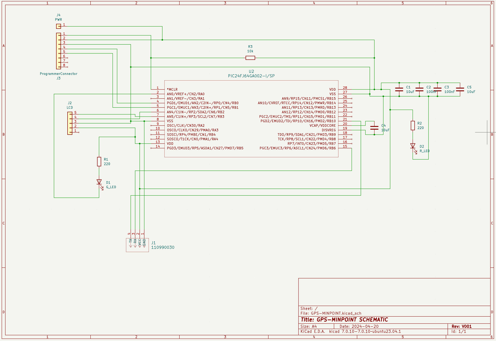

# Hardware

This folder contains all work and documentation regarding the hardware. 

For this project, a custom PCB was designed using KiCAD. All footprints, schematics, and 3D files can be found under the `/lib/` folder.

### Current Design:
