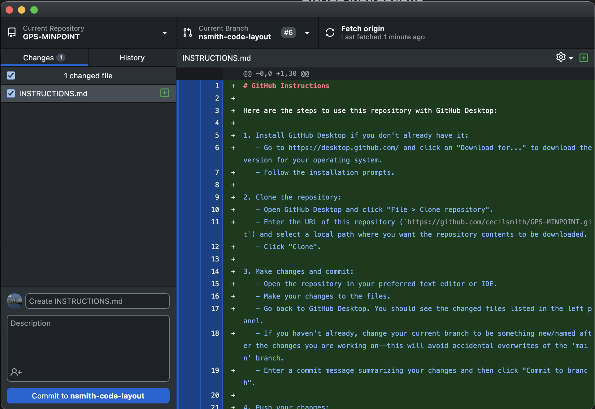

# GitHub Instructions

Here are the steps to use this repository with GitHub Desktop:

1. Install GitHub Desktop if you don't already have it:
   - Go to https://desktop.github.com/ and click on "Download for..." to download the version for your operating system.
   - Follow the installation prompts.

2. Clone the repository:
   - Open GitHub Desktop and click "File > Clone repository".
   - Enter the URL of this repository (`https://github.com/cecilsmith/GPS-MINPOINT.git`) and select a local path where you want the repository contents to be downloaded.
   - Click "Clone".
   
3. Make changes and commit:
   - Open the repository in your preferred text editor or IDE.
   - Make your changes to the files.
   - Go back to GitHub Desktop. You should see the changed files listed in the left panel.
   - If you haven't already, change your current branch to be something new/named after the changes you are working on--this will avoid accidental overwrites of the 'main' branch.
   - Enter a commit message summarizing your changes and then click "Commit to branch".
   
4. Push your changes:
   - In GitHub Desktop, click "Push origin" to push your committed changes to the remote repository on GitHub. 
   
5. Pull latest changes:
   - If someone else has modified the code click "Fetch origin" to retrieve them.
   - To merge the updates into your local repository, click "Pull origin".

Now you have the repository on your local machine and can use GitHub Desktop to push and pull changes to sync with the remote repository on GitHub.

